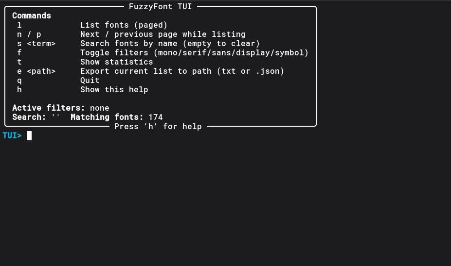
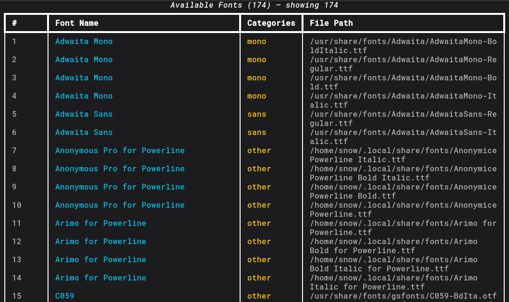

# FuzzyFont

fuzzyfont a small Python utility that helps with browsing, listing, identifying and exporting fonts easily with or without a UI. It’s kinda like a “font browser for your terminal” but with some nifty features like filtering, searching, stats, and exporting.

FuzzyFont has a built-in TUI to make it even more accesible!


---

## Features ✨

* List all fonts installed on your system
* Filter by type:

  * Monospace (`--mono`)
  * Serif (`--serif`)
  * Sans-serif (`--sans`)
  * Display/Decorative (`--display`)
  * Symbol/Emoji (`--symbol`)
* Search fonts by name (`--search`) 
* Export font list to JSON or TXT (`--export [PATH]`)
* Show some basic stats like counts per category (`--stats`) 
* Interactive terminal UI (`--tui`) if you like poking around in a console menu instead of command flags

---

## Installation

Download the files & make sure you have Python 3 installed and some dependencies:

```bash
pip install rich matplotlib --break-system-packages
```
Or use a venv:

1. Linux/MacOS:
```bash
python -m venv venv
source venv/bin/activate
```

2. Windows:
```bash
python -m venv venv
venv\Scripts\activate
```

---

## How it works 

* Uses `matplotlib.font_manager` to find all system fonts
* Font classification is done using:
  1. Override mapping for popular fonts
  2. Font family metadata 
  3. And finally, heuristic classification in case the first two fail.
* Uses `rich` to make your terminal output look slightly less boring

---

## Usage 

### CLI
CLI output looks like this:



```bash
# list all fonts
python font_explorer.py
```

```bash
# list only monospace fonts
python font_explorer.py --mono
```

```bash
# search for "Roboto"
python font_explorer.py --search Roboto
```

```bash
# show stats
python font_explorer.py --stats
```

```bash
# export to JSON
python font_explorer.py --export fonts.json
```

```bash
# limit how many fonts are shown
python font_explorer.py --limit 20
```

---

### Interactive TUI 

```bash
python font_explorer.py --tui
```

Once inside, you can type:

* `l` → list fonts (paged, like 16 per page)
* `n / p` → next / previous page
* `s <term>` → search fonts
* `f` → toggle filters (mono/serif/sans/display/symbol)
* `t` → show stats
* `e <path>` → export current list
* `q` → quit
* `h` → help

The `f` command will activate a selection screen, type the number you want (single numerals only) and after slecting all the filters you want, enter `0` to finalize it, you filter will apply.
Pretty self-explanatory once you start playing around.

---

## Example Output

```
#  Font Name       Categories       File Path
1  Roboto          sans             /usr/share/fonts/Roboto-Regular.ttf
2  Courier New     mono             /usr/share/fonts/CourierNew.ttf
3  Times New Roman serif            /usr/share/fonts/TimesNewRoman.ttf
...
```

Stats table shows counts per category + a few example fonts.

---

## Notes 🤔

* It’s kinda “best effort” — classification is purely based on font name, so it might get weird sometimes, or might not categorise fonts rightly.
* Works on macOS, Linux, Windows — anywhere `matplotlib.font_manager` can find fonts.

---

## License

Licensed under [Unlicense](https://unlicense.org)
